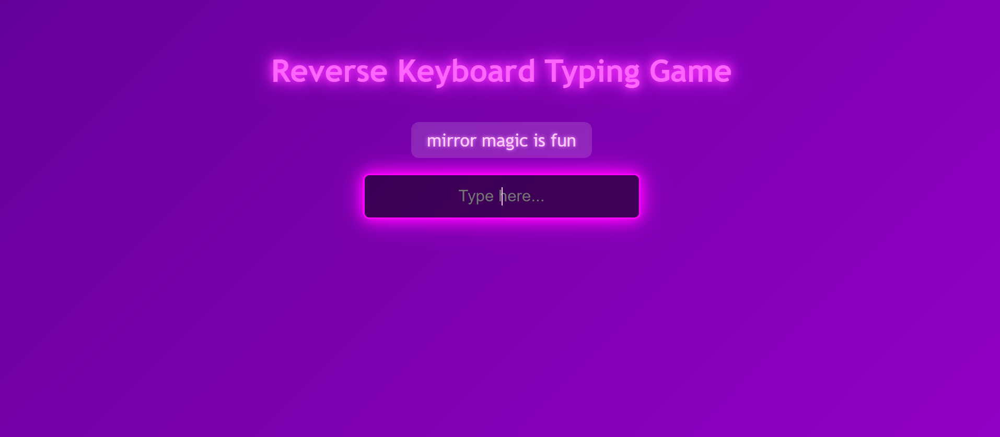
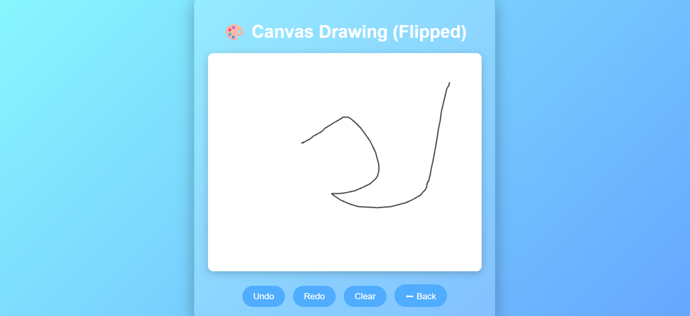
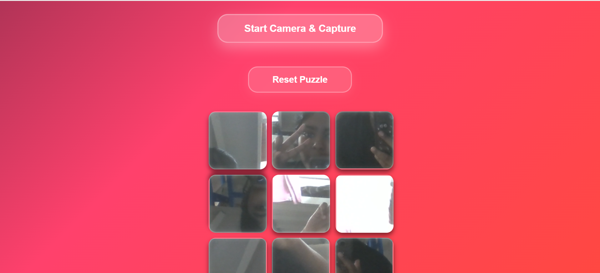
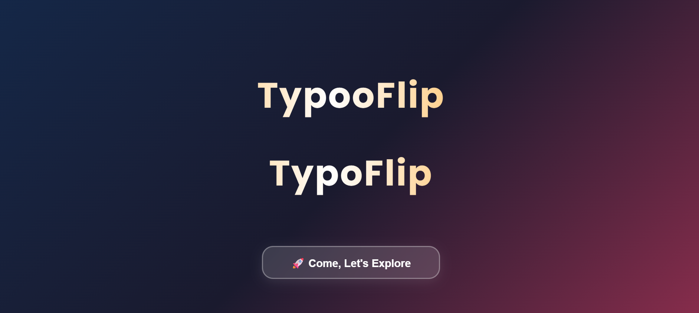
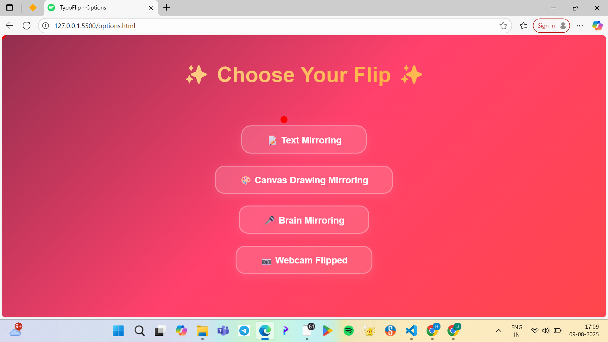

# TYPOFLIP 🎯

## Hey its just a small funny project where all the inputs are flipped along with some fun games
TRY IT: https://hameethanassar760.github.io/useless_project_temp/

### Team Name: Null And Void

### Team Members
- Team Lead: Hameetha Nassar -GEC PALAKKAD
- Member 2: Haleemathul Husna - GEC PALAKKAD
- 

### Project Description
Main Purpose: Let users pick different “flip” modes for text, drawing, speech, or webcam.

Options Page:

Has buttons to go to different pages:

1. Text Mirroring → likely flips typed text.

2. Canvas Drawing Mirroring → flips drawing directions.

3. Brain Mirroring → maybe flips speech or decision-making responses.

4. Webcam Flipped → probably flips live camera feed horizontally.

## Technical Details
### Technologies/Components Used
For Software:
- HTML
-CSS
-JAVASCRIPT
# Installation
-https://hameethanassar760.github.io/useless_project_temp/

### Project Documentation
For Software:
-Text mirroring in action — letters reverse as you type.
-Drawing board mirroring strokes in real-time.
-Webcam feed flipped horizontally.

# Screenshots

## Team Contributions
- Hameetha Nassar: developed the project
- Haleemathul Husna: designed the project
- 

---
Made with ❤️ at TinkerHub Useless Projects 

